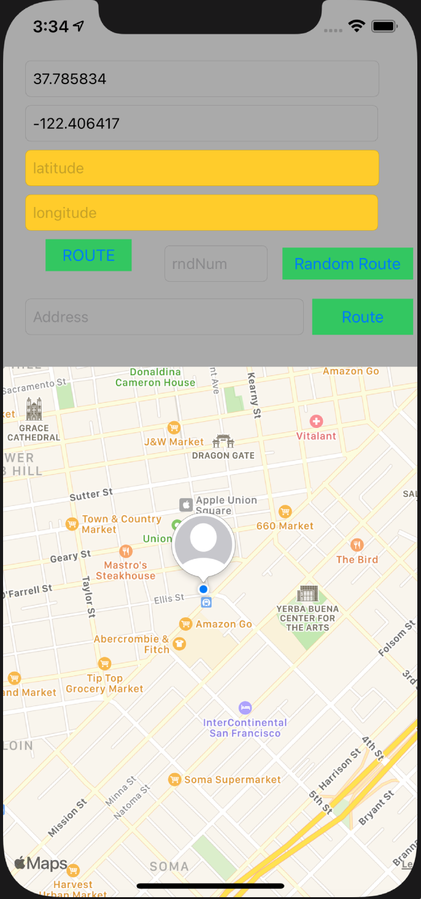
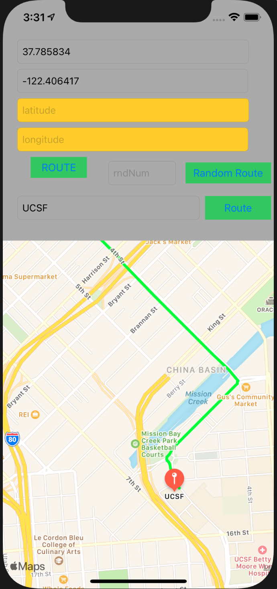
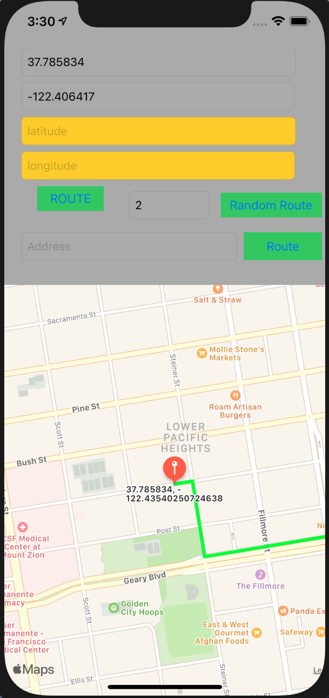
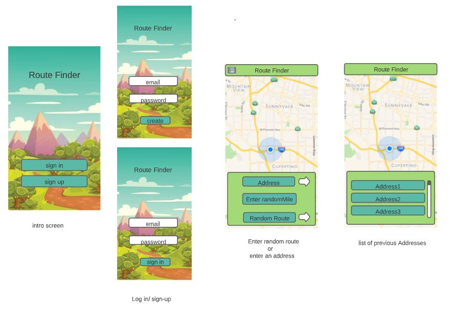
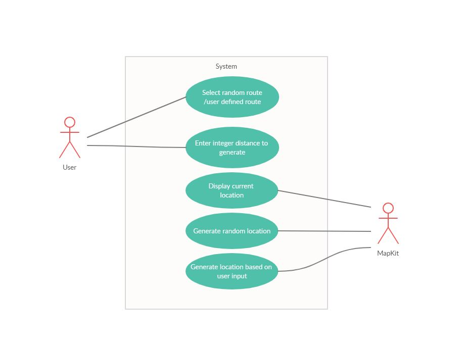
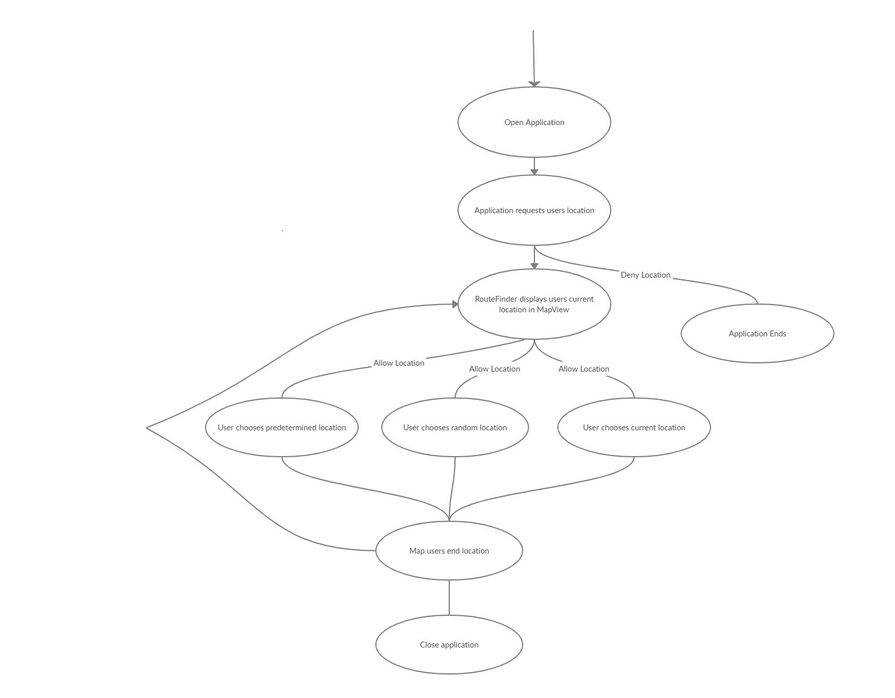
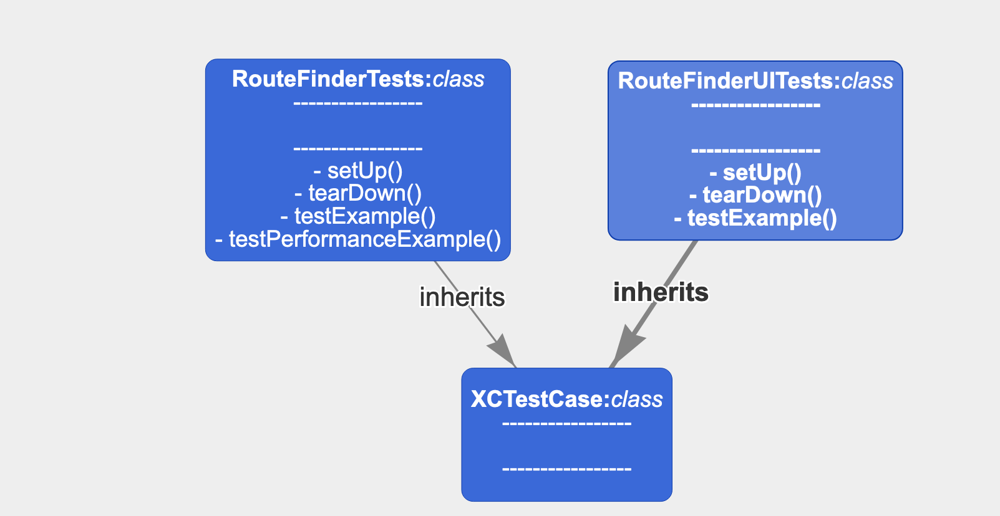
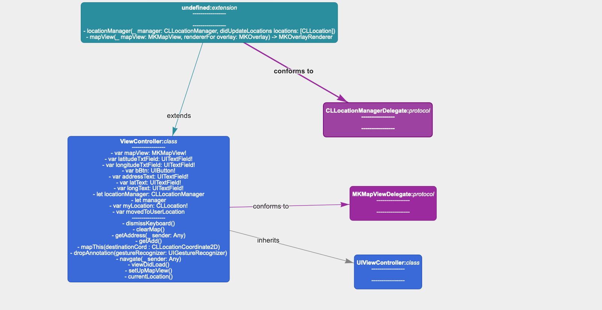
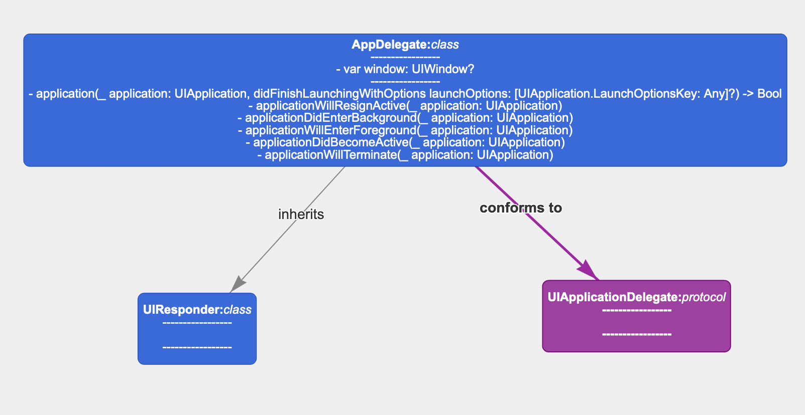
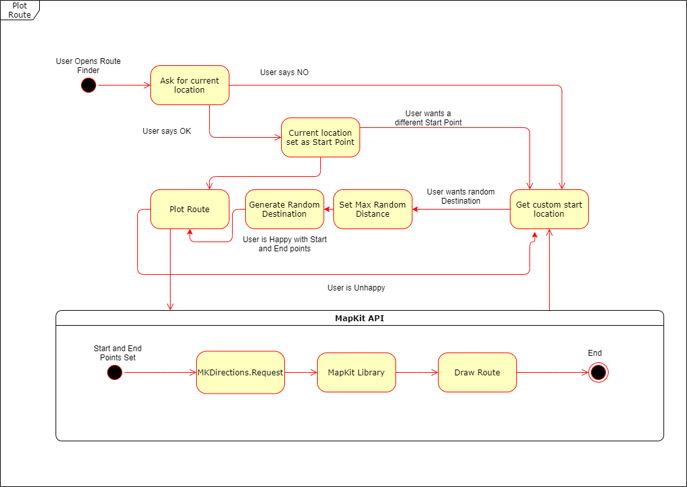

# Route Finder Documentation

# Table of Contents
1. [Introduction](#Introduction)
2. [Usage](#Usage)
3. [Overall Description](#Overall-Description)
4. [External Interface Requirements](#External-Interface-Requirements)
5. [System Features](#System-Features)
6. [Other Nonfunctional Requirements](#Other-Nonfunctional-Requirements)
7. [Appendix A: Analysis Models](#Appendix-A-Analysis-Models)
8. [User Diagrams](#user-diagram)
9. [Data Flow Diagrams (DFD)](#data-flow-diagrams-dfd)
10. [Class Diagrams](#Class-Diagrams)
11. [State Transition Diagrams](#State-Transition-Diagrams)
12. [Entity Relationship Models](#Entity-Relationship-Models)
13. [Appendix B: To-Be-Determined List](#Appendix-B-To-Be-Determined-List)

## Introduction
1.  Purpose

    This program is intended to fufill the needs of someone who needs to plot a route between two points, especially for the purpose of running, biking, jogging, or wandering around. 

2. Document Conventions

    This document will conform to github Markdown conventions for ease of rendering cross-platform. The following conventions are used:
    
    - API => Application Programming Interface

3. Intended Audience and Reading Suggestions

    This document is intended for development team members and should adhere to basic highschool and above reading/writing levels.

4. Product Scope

    This project will be developed within multiple iterations inside of (1) semester at California State University, Fullerton. The bulk of the work is accessing the MapKit API from Apple's IOS platform and any data will be stored locally. User location is accessed upon consent from the user.

5. References and Resources

    1. [Apple Maps API](https://developer.apple.com/maps/)
    2. [Github Repository](https://github.com/drotter120/route_finder)
    3. [Agenda and Meeting Notes](https://docs.google.com/document/d/1wHMqEeARNPuieJ8bT2oxALY_5HoHTPM_qxM7svoKMwg/edit?usp=sharing)
    4. [CodeMentor Mapkit Demo](https://www.codementor.io/@muneebali/mapkit-user-current-location-10xdbyy1v3)
    5. [Ray Wenderlich Mapkit Tutorial](https://www.raywenderlich.com/7738344-mapkit-tutorial-getting-started)
    6. [Youtube Mapkit Demo](https://www.youtube.com/watch?v=YtYEGsi2HB4)
    7. [Virtualbox With QEMU](https://github.com/myspaghetti/macos-virtualbox)
    8. [Virtualbox FAQ on Reddit](https://www.reddit.com/r/virtualbox/comments/dpihyd/read_this_first_macos_on_virtualbox/)

 
## Usage
1. Loading the Application
    
    Upon opening the app, the splash screen will load. If you see this screen for over 30 seconds, please report this problem to the development team.

    

2. Allowing User Location 

    When opening the app for the first time, a prompt to allow user location access will appear. If you choose to allow, then the app will start with your current location as the starting point. Otherwise you will have to enter that information manually.

    

    Afterwards, the home screen will show.

    

3. Setting a Specific Destination

    You can enter a location to route to either by coordinates, or address.

    

4. Setting a Random Destination

     You can enter a distance for a random location into the miles input box.

     

5. Plotting a Route

    Once you have a destination, you can plot your route by tapping the Route button.

    

## Overall Description
1. Product Perspective

    The is a simple route-finding and route-generating tool that will be available for the IOS operating system. Using this program, users can find a location and generate a route to that location.

2. Product Functions

    There will be **6** distinct functions.
    1. Show current location
    2. Show user-input location (manual latitude and longitude or long press on the map)
    3. Generate a path (directions) to a user-input location
    4. Generate a path (directions) to a random location within user-input miles
    5. Save a path to a profile list
    6. Export a profile list to a string for sharing with other users or backup purposes
    
3. User Classes and Characteristics
    
    General user - anyone who wants to find a route between two points, for any purpose such as jogging, biking, hiking, or wandering out.

    General users can perform the following functions:
    - Set the destination point
    - Set the starting point
    - Generate a path between the starting point and destination point
    - Set the random maximum distance
    - Set the random minimum distance
    - Export the current path as a string
    - Copy the exported path by tapping a button

4. Operating Environment
    
    This app will be run on the IOS system.
    - MapKit API Requests
    - Serverless Architecture
    - platform: IOS/Swift/Mapkit

5. Design and Implementation Constraints

    1. We are beholden to Apple's API (mapkit) and the rest of their user-interface components to run on IOS.
    2. Mapkit API calls for the required functionality
    3. Implement an intuitive user interface so the user is not lost

6. Assumptions and Dependencies
    
    1. The user must have a device running IOS version (3.0) or higher
    2. The app must be installed
    3. The device must be turned on and the app must be running
 
## External Interface Requirements
1. User Interfaces
    - Front end: SWIFT & IOS GUI libraries
    - Back end: MapKit (IOS 3.0+ library)

    
2. Hardware Interfaces
    - Touch
    - Bluetooth keyboard
    - Bluetooth mouse
    - Iphone
    - Ipad
    - Iphone simulator
    - Hacked client (we don't care about this one, if it breaks it's not our problem)

3. Software Interfaces
    - Mapkit
    - CoreLocation
    - IOS System Calls (User Input, Draw GUI, Request location)

4. Communications Interface
     This project supports all types of IOS devices so long as they are version 3.0+. There are simple input forms for the user to specify their routes.
 
## System Features
1. General Appearance

2. Description and Priority

    The route finder application can assist many kinds of users in finding new paths to travel, encourage exercise, and prevent boredom. Ergo, this project is of the highest priority.

3. Functional Requirements

    1. The user will launch the app, and the first thing they will see is a login prompt, requesting for username and password
    2. Username and password will be quickly verified, and then the app will proceed to the next point.
    3. A map will be displayed, with the current coordinates and 3 buttons present
            1. Address - Displays a submenu with a list of previous addresses
            2. Distance - Requests user to give a distance, and then creates a route going that distance and back
            3. Random Route - Randomly selects a previous address from the aforementioned list.

 
## Other Nonfunctional Requirements
1. Performance Requirements

    1. Simulator will be slow. Deal with it.
    2. Any iPhone or iPad that can run the required operating system should be fine.
    3. This is not a high-performance or performance-critical application.

2. Safety Requirements

    1. Don't break github. Branch your code.

3. Security Requirements

    1. No sensitive data is stored, security is moot.

4. Software Quality Attributes

    1. Reliability - K.I.S.S. Keep it simple
    2. Functionality - Do our key functions and do them well
    3. Performance - Don't be the performance bottleneck

5. Business Rules

    1. Allow cross-group discussion for all important matters.
    2. Everyone reviews code before submissions.
    3. Everyone tests before submissions.

6. User Documentation
    
    To compile and run:

    1. Clone repository 
        
        `git clone https://github.com/drotter120/route_finder.git`
    2. Open XCode project file in 'RouteFinder' folder
    3. Click the run icon.
    4. Simulator will open, have fun.

 
 
## Appendix a: Analysis Models

## User Diagram

## Data Flow Diagrams (DFD)

## Class Diagrams
    
Test Units    

View Controller     

App Delegate     

## State Transition Diagrams
    

## Entity Relationship Models
    
None - No database needed

 
## Appendix C: To-Be-Determined List
   
- Testing and Testing Methodology - currently have [Testing Spreadsheet](https://docs.google.com/spreadsheets/d/1r9WiNwj2ovsCwUcVcCsD2JVtbHmEBJ4vWiULwC1oEas/edit?usp=sharing)
